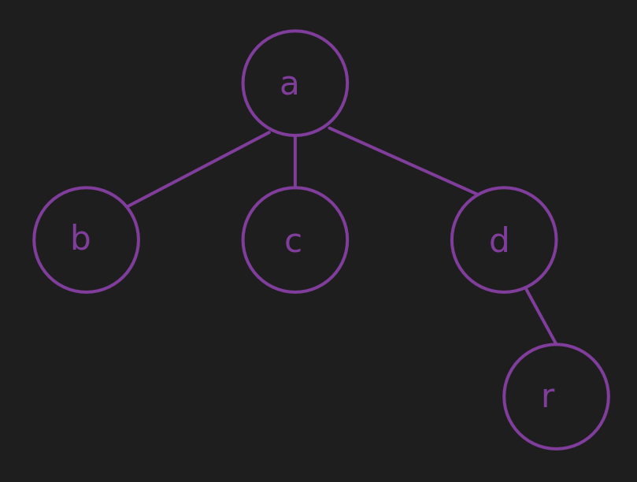

# Other functions on sheme:
- ## Multiway trees
Their representation:
```bash
'(a ((b ())
     (c ())
     (d ((r ())))))
```

### Is a multiway tree?
``` scheme
(define isntree?
  (lambda (tree)
    (cond((null? tree) #t)
         ((> (length tree) 2) #f)
         ((= (length tree) 1) #f)
         (else (andmap isntree? (cadr tree))))))
```
